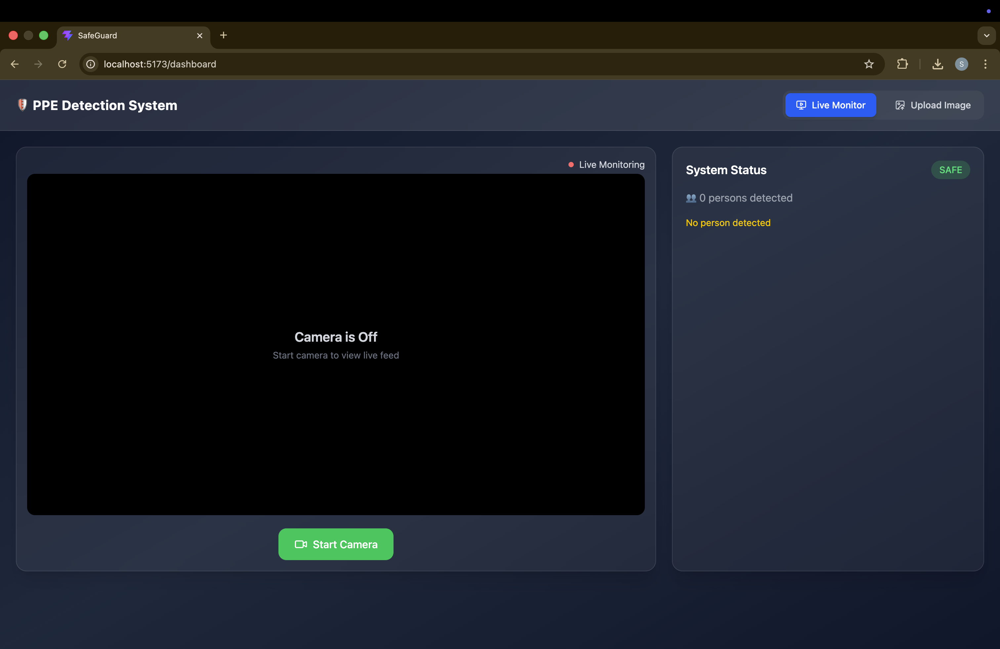
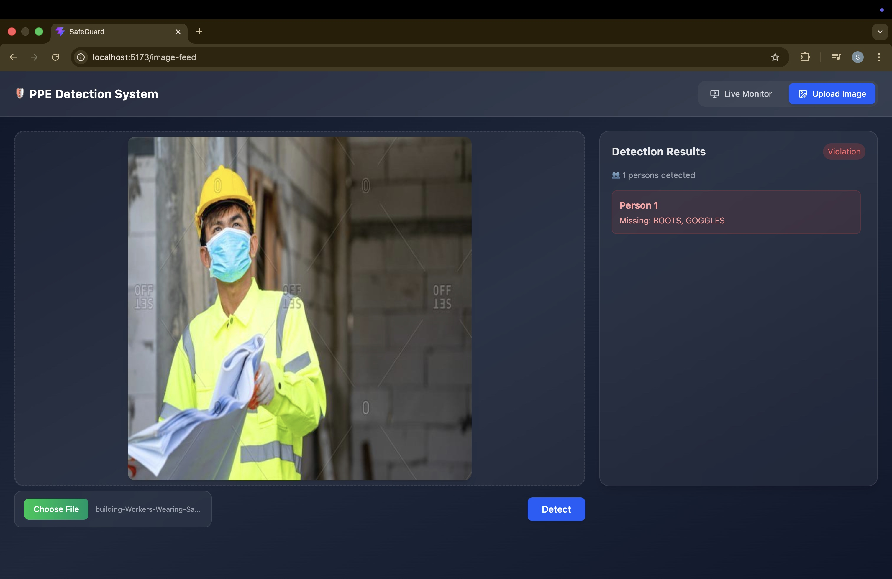
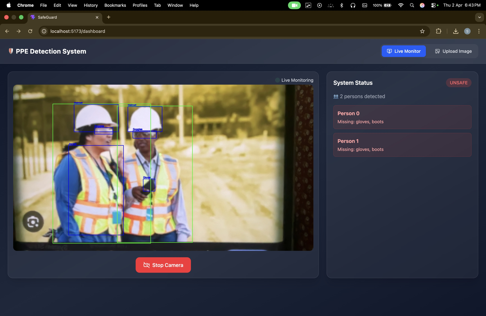

# 🦺 PPE Kit Detection System

An AI-powered real-time Personal Protective Equipment (PPE) detection system using **YOLOv8**, **FastAPI**, and **React**.

The system detects safety compliance (helmet, jacket, gloves, boots, goggles) from **live video streams** and **uploaded images**, and highlights violations in real time.

---

## 🚀 Features

- 🔴 Real-time PPE detection via webcam
- 🟢 Image upload & detection
- ⚠️ Automatic violation detection (missing PPE)
- 🎯 Person-wise PPE analysis
- 🎥 Live video streaming using FastAPI
- 📊 Real-time alert system
- 🔄 Start/Stop camera control
- ⚡ Fast and lightweight backend

---

## 🧠 Tech Stack

### Backend
- Python
- FastAPI
- OpenCV
- Ultralytics YOLOv8
- PyTorch

### Frontend
- React (Vite)
- Tailwind CSS
- React Router

---

## 📂 Project Structure
```
PEE_kit_detection/
│
├── ml_service/
│ ├── app.py # FastAPI backend
│ ├── requirements.txt # Python dependencies
│ ├── utils/
│ │ └── logic.py # Violation detection logic
│ └── models/ # (Not included in repo)
│
├── frontend/
│ ├── src/
│ ├── package.json
│
└── README.md
```

---

## 🧪 API Endpoints

| Endpoint | Method | Description |
|--------|--------|------------|
| `/detect_image` | POST | Upload image & detect PPE |
| `/video_feed` | GET | Live video stream |
| `/latest_status` | GET | Get latest detection status |
| `/toggle_camera` | POST | Start/Stop webcam |

---

## 🧠 How It Works

1. Webcam captures frames  
2. Human detection model identifies persons  
3. Each person is cropped  
4. PPE model runs on each crop  
5. Missing PPE is detected  
6. Alerts are generated and streamed  

---

## 📸 Screenshots

> 📌 Add your screenshots here

### 🔹 Dashboard (Live Detection)


### 🔹 Image Detection


### 🔹 Violation Alert


---

## 📦 Model Weights

⚠️ Model files are not included due to size.

👉 Download from:  
**https://drive.google.com/drive/folders/15PjZgrJML0rLKwg8MUtdO2RfZMYwkf1P?usp=drive_link**

After downloading, place inside: 
```
ml_service/models/

```
Example:

```
ml_service/models/best.pt

```

---

## ⚙️ Installation & Setup

### 🔹 1. Clone Repository
```
git clone https://github.com/arcane-2004/PEE_kit_detection.git

cd PEE_kit_detection
```

---

### 🔹 2. Backend Setup
```
cd ml_service
python -m venv venv
source venv/bin/activate # Mac/Linux
venv\Scripts\activate # Windows

pip install -r requirements.txt
```

---

### 🔹 3. Run Backend
```
uvicorn app:app --reload
```
Backend runs at:  
```
http://127.0.0.1:8000
```

---

### 🔹 4. Frontend Setup
```
cd frontend
npm install
npm run dev
```

Frontend runs at:  
```
http://localhost:5173
```
Create a `.env` file in the `client` directory:

```env
# Backend API URL
VITE_API_BASE_URL=http://localhost:8000


---

## 🎮 Usage

- Open frontend in browser  
- Start camera using UI  
- View live detection  
- Upload images for testing  
- Monitor alerts in real-time  

---

## 📌 Future Improvements

- 🔁 Person tracking (DeepSORT / ByteTrack)  
- 🔊 Sound alerts for violations  
- ☁️ Cloud deployment  
- 📊 Violation history dashboard  
- 🧠 Model optimization  

---

## 🤝 Contributing

Pull requests are welcome! Feel free to improve the system.

---

## 📜 License

This project is for educational purposes.

---

## 👨‍💻 Author

**Sumit Kumar**

---

## ⭐ If you like this project

Give it a ⭐ on GitHub!
